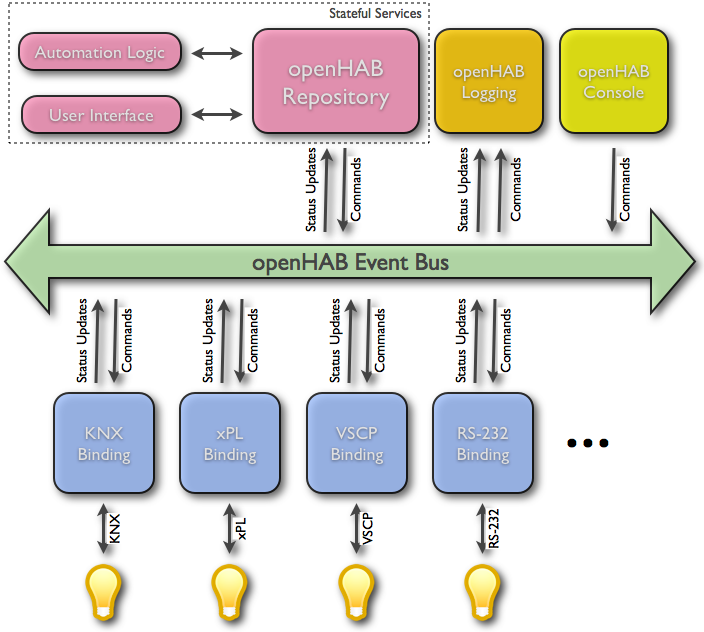

- title : Hacking und Smarthome mit dem Raspberry Pi
- description : Introduction to openHAB
- author : Sven Sönnichsen
- theme : night
- transition : default

***

## Hacking und Smarthome mit dem Raspberry Pi

Sven Sönnichsen

[sven@sven-s.de](mailto:sven@sven-s.de)

[twitter.com/sven_s](http://twitter.com/sven_s)

***

## Fahrplan für den Workshop

- 10-12 Uhr Intro und Raspi Grundlagen
- 13-15 Uhr openHAB und MQTT 
- 15-18 Uhr Projekt umsetzen   

***

## Was ist ein Raspberry Pi

### Und wie spricht man es aus?

> Pie => Himbeerkuchen  
> Pi => Python Interpreter

 

---

## Raspi Fakten 

- 35,- € ARM Einplatinencomputer => jetzt auch mit Quadcore 
- Seit Anfang 2012
- Mehr als 5 Millionen mal verkauft 
- Linux, Android, Risc OS, Windows 10!
- Schnittstellen: USB, HDMI, Audio, SD Card, Ethernet, GPIO
- Geringer Stromverbrauch: 2,5W bis max. 4W
- ca. 7,- € pro Jahr bei 3W
- Alternativen: ODROID (2GB RAM), Banana Pi (SATA)

 

 

---

## Projekte mit Raspi
- Mediacenter mit Kodi aka. XBMC, OpenELEC
- Musicplayer, Spotify, Airplay, Webradio
- Surfstation, Rechner für Kinder
- Asterisk Server (SIP, FreePBX), Mumble
- Webserver, Mailserver, NAS, Printserver 
- Hosting im Datacenter 36,- € pro Jahr
- Fotoautomat
- Elektronikprojekte
- Smarthome

---

## Was ist Hacken?

> ** Wau Holland**: Ein Hacker ist jemand, der versucht einen Weg zu finden, wie man mit einer Kaffeemaschine Toast zubereiten kann

- Alltagssprachlich: Eindringlinge in Computersysteme
- Experimentieren, die Grenzen des Machbaren zu erkunden
- Einfallsreiche Experimentierfreudigkeit
- Mit besonderem Sinn für Kreativität und Originalität => Hack Value
- Ergebnis => Hack
- Maker, Hackerspaces

---

## Was ist ein Smarthome?
#### Intelligentes Wohnen, eHome, Smart Living
- Vernetzung von Haustechnik und Haushaltsgeräten 
- Smart Metering
- Vernetzte Unterhaltungselektronik
- Sicherheit

---

## Hersteller, Produkte, Protokolle
- Homematic, RWE Smarthome, eQ-3 MAX, FS 20
- Philips Hue (ZigBee)
- ZWave, EnOcean, KNX, Digitalstrom, etc.
- Intertechno (Funk 433 Mhz), IP, Bluetooth
- Alles inkompatibel, eingeschränkter Funktionsumfang
- Vorgegebene Server, teils mit API
- Irgendwie nicht Hacker kompatibel!

***

## Smarthome
### Was will ich eigentlich erreichen?

---

Es klinget!

---

Leider nur an der Ritto Türstation direkt neben der Tür!

---

Kinder lassen die Tür offen stehen

---

Rollladensteuerung, die autark ist

 

---

## Regelbasierende Steuerung vom Phone und Web

- Sonnenstand, Temperatur, Präsenz berücksichtigen
- Neue Geräte sollen *leicht* einbindbar sein
- Diverse *Standards* müssen unterstützt werden
- Daten und Messwerte sollen offen zugänglich und auswertbar sein
- Regeln müssen *Kreativität* ermöglichen 

*** 

## Smarthome
### Aktueller Stand

---

Klingel mit Push Notification

---

Es bimmelt nun auch in der Küche!

 
---

Türstation mit Z-Wave Sensor

---

Türsensor mit Z-Wave Sensor

---

Bewegungsmelder mit Z-Wave Sensor

---

Z-Wave Controller für Raspberry

---

RFX Transceiver für Rolläden

---

Sensoren für Temperatur und Raumfeuchte 

---

Diverse Steckdosenschalter und Handsender

--- 

Squeezebox

---

Philips Hue

---

## Rollladensteuerung

- Bei Sonnenuntergang schließen, wenn keiner zuhause
- Wenn keiner zuhause und es unter 5 Grad, dann schließen
- Abends erst schließen, wenn wir ins Bett gehen
- Morgens öffnen, wenn es Zeit ist

--- 

## Wakeup Script

- Rollladen öffnen (unterschiedlich je nach Raum und Fenster)
- Licht einschalten bzw. dimmen
- Radio einschalten
- Licht wieder ausschalten
- Radio auschalten

***

## Raspi basics

- Installation: copy image to SD card
  - Win32DiskImager, dd 
- Configure: sudo raspi-config
- Updating kernel: sudo rpi-update

--- 

## GPIO 

- General Purpose Input/Output pins
- LED, Sensors, Display, etc. 
- For B+ Model
- 40 Pins, 2 +5V, 2 +3.3V, 1 + 4 Ground
- 26 programmable
  - 5 SPI (serial bus system), I2C
  - 2 with Pull Up 1.8 kOhm
  - 2 UART (serial ports)
- Warning! You can destroy your Raspi easily!

***

# Linux Basics

---

### Linux Commands

- ls, cd, pwd, mkdir, rmdir, rm, cp, mv, touch, cat
- head, tail, chmod, chown
- ssh, scp, sudo, dd, df, unzip, tar
- pipes, tree, &, wget, curl,
- man, grep, awk, find, whereis
- ping, nmap, hostname, ifconfig 

---

### Good to know

- Execute shell script ./script.sh
- Scipts must have execution flag: chmod u+x script.sh

---

### Editing files
- nano
  - easy to use editor with keyboard shortcuts
- vi
  - standard editor on every linux/unix
  - works with modes: normal, insert, visual, select
  - vim must be installed: sudo apt-get install vim
- emacs
  -  sudo apt-get install emacs

---

## ssh

- secure shell => verschlüsselte Netzwerkverbindung 
- Username und Passwort
- Public und private Key
- Putty => Windows
- mosh
  - Verbindung bleibt offen
  - Zeigt sofort an, welche Tasten getippt wurden

---

### Managing users

- Default user: **pi** with password **raspberry**
- passwd
- sudo passwd bob
- sudo adduser bob
- Home folder: /home/user
- skel /etc/skel
- sudoers
  - pi is a sudoer
  - add another user: sudo visudo
- sudo userdel -r bob
  
---

## APT
### Advanced Packaging Tool

- Must be sudoer or root
- Software sources /etc/apt/sources.list
- Update sources list: sudo apt-get update
- install: sudo apt-get install tree
- uninstall: sudo apt-get remove tree
- purge: sudo apt-get purge tree
- upgrade after update: sudo apt-get upgrade
- distribution upgrade: sudo apt-get dist-upgrade
- search for a package: apt-cache search
- dpkg => intstall only packages; not so clever as apt-get
- Pi Store, pip, ruby gems

***

# openHAB

- open Home Automation BUS
- Java, OSGi Bundles
- Runtime, Addons, Designer 
- Asynchronous event bus
- stateful repository, which can be quiried
- Sitemap, Item UI Providers

---

# Why openHAB

- Unterschiedlichste Hardware miteinander verbinden
- Zukunftssicher und offen (open source)
- Beliebige Controller Hardware (jede Java Plattform)
- Das Wichtige sind die Regeln!
- No Cloud
- Keine Kosten
- Grosse, aktive Community

---
## Architecture

---

## The Event Bus

There are mainly two types of events:

1. Commands which trigger an action or a state change of some item/device.
2. Status updates which inform about a status change of some item/device (often as a response to a command)

3. All protocol bindings (which provide the link to the real hardware devices) should communicate via the Event Bus.

---

## Item Repository 

---

### Bindings! This really rocks!
<small>
AlarmDecoder,
Anel,</small>
Asterisk,
Astro,<small>
BenQ Projector,
Bluetooth,
Bticino,
Comfo Air,
Config Admin,
CUL,
CUPS,
DAIKIN,
Davis,
digitalSTROM,
DMX512,
DSC Alarm,
DSMR,
Ecobee,
EDS OWSever,
eKey,
Energenie,
EnOcean,
Epson Projector,
Exec,
Freebox,
Freeswitch,
Fritz AHA,
Fritz!Box,
FS20,
Global Cache IR,</small>
GPIO,<small>
HAI/Leviton OmniLink,
HDAnywhere,
Heatmiser,
Homematic / Homegear,</small>
HTTP,<small>
IEC 62056-21,
IHC / ELKO,
ImperiHome,
Insteon Hub,
Insteon PLM,
IRtrans,
jointSPACE-Binding
KNX,
Koubachi,
Leviton/HAI Omnilink,
Lg TV,
MAX!Cube-Binding
MAX! CUL,
MiLight,
MiOS,
Modbus TCP,
MPD,</small>
MQTT,
MQTTitude,<small>
Neohub,
Nest,
Netatmo,</small>
Network Health,<small>
Network UPS Tools,
Nibe Heatpump,
Nikobus,
Novelan/Luxtronic Heatpump,</small>
NTP,<small>
One-Wire,
Onkyo AV Receiver,
Open Energy Monitor,
OpenPaths presence detection,
OpenSprinkler,
OSGi Configuration Admin,</small>
Philips Hue,<small>
Piface,
pilight,
Pioneer-AVR-Binding
Plugwise,
PLCBus,
Pulseaudio,</small>
RFXCOM,<small>
Samsung AC,
Samsung TV,
Serial,
Satel Alarm,
Snmp,
Somfy URTSI II,
Sonos,</small>
Squeezebox,<small>
Swegon ventilation,
System Info,
TCP/UDP,
Tellstick,
TinkerForge,
Tivo,
VDR,
Velleman-K8055-Binding
Wake-on-LAN,
Waterkotte EcoTouch Heatpump,</small>
Weather,<small>
Wemo,
Withings,
XBMC,
xPL,
Yamahareceiver,
Zibase,
</small>
Z-Wave,

---

## Installation

- Runtime in ein Verzeichnis entpacken
- Die benötigten Addons ins Addons Verzeichnis kopieren
- openhab.cfg erstellen mit den notwendigen Einträgeen aus openhab_default.cfg
- Optional: Demo Package kopieren
- starten
- http://localhost:8080/openhab.app?sitemap=demo
- openHAB Designer 

---

## Configuration

- openhab.cfg
- sitemaps
- items
- rules
- scripts
- transform
- persistence

---

## Logdateien anpassen

- Edit logback.xml (logback_debug.xml)
- Add new Appender e.g. for binding
- Add new Logger with desired Level and namespace
- Use tail

---

## Habmin2

- Side project to openHAB
- Display charts
- Edit rules
  - graphical
  - textual
- Z-Wave Extras  
- Display sitemaps

---

## Z-Wave

- Low Power, reliable, low latency
- 868 kHz, small data packages, up to 100kbit/s
- Mesh network with 232 Nodes
  - Controller
  - Slave devices
  - Retransmit messages, max. 4 hops
  - around 30 m range   
- 250 manufacturers 

--- 

## 433.92 Mhz

- ISM Band (Industrial, Scientific and Medical)
- Sensoren, Steckdosen, Schalter
- div. Hersteller

***

# Push it baby!

## How to send push notification

---

## Pushover
- iOS, Android, Desktop (Chrome, Firefox, Safari)
- Pullover (Windows, Mac, Linux)
- Preis: 4,99 $/€ einmalig, 7500 notification per month per application
- API für so ziemlich alle Sprachen 

---

## Prowl
- Ähnlich wie Pushover, nur für iOS
 
***

## MQTT

- Message Queue Telemetry Transport
- Machine To Machine, IOT connectivity protocol
- Lightweight publish/subscribe protocol, Broker
- Mosquitto, Mosca, Rabbit MQ (mit Pligin)
- Public hosted test server

---
## MQTT Ziele

- Die Implementierung muss einfach sein, um auch Geräte mit eingeschränkten Ressourcen damit zu vernetzen.
- Es muss unterschiedliche Servicequalitäten bei der Datenübertragung geben, damit die Übertragung auch in instabilen Netzen gewährleistet wird.
- Die Übertragung muss einfach und effizient die zur Verfügung stehende Bandbreite nutzen.
- Da bei Wiederaufnahme abgebrochener Verbindungen oft Metainformationen erneut gesendet werden, wäre es von Vorteil, diese serverseitig zu speichern (Session-awareness).
- Das Protokoll sollte unterschiedliche Datentypen übertragen können und nicht auf eine bestimmte Struktur festgelegt sein (datenagnostisch).

http://www.heise.de/developer/artikel/MQTT-Protokoll-fuer-das-Internet-der-Dinge-2168152.html

---
## MQTT Publish Subscribe

---

## MQTT Topics und Wildcards

- Zuhause/Wohnzimmer/Temperatur
- Zuhause/Wohnzimmer/Luftfeuchtigkeit
- Zuhause/Schlafzimmer/Temperatur
- Zuhause/Schlafzimmer/Luftfeuchtigkeit
- Zuhause/+/Temperatur
- Zuhause/Wohnzimmer/#
- #
- + => nur eine Hierarchiestufe
- # => mehrere Hierarchiestufe aber am Ende

---

## MQTT Quality control
 
 - MQTT basiert auf TCP
 - Servicelevel 0, 1, 2
 - 0 => keine Garantie
 - 1 => min. 1 mal
 - 2 => genau 1 mal

---

### MQTT Last Will, Retained Message

- Last will with topic and message
- Wenn Broker einen Verbindungsabbruch bemerkt, wird Last will gesendet
- Retained Message
- Senden des letzten Wertes and neu verbundene Clients

--- 

#### MQTT Connect

	[lang=js]
	MqttClient client = new MqttClient("tcp://broker.mqttdashboard.com", 
	"MyfirstMQTTClient", new MemoryPersistence());

	client.connect();
	
---

#### MQTT Last will

	[lang=js]
	MqttClient client = new MqttClient("tcp://broker.mqttdashboard.com", 
 	"MyfirstMQTTClient", new MemoryPersistence());
 	
	MqttConnectOptions mqttConnectOptions;

	mqttConnectOptions = new MqttConnectOptions();
	
	mqttConnectOptions.setWill(
 		"Zuhause/Wohnzimmer/Temperatur/Status",    // Topic
 		"offline".getBytes("UTF-8"), // Nachricht
 		1, // QoS
 		true); // Retained Message
 	
 	client.connect(mqttConnectOptions);
 		
	client.publish(
		"Zuhause/Wohnzimmer/Temperatur", // Topic
		"23.4".getBytes("UTF-8"), // Nachricht
		1, // QoS
		true); // Retained Message  
		
---

### Start with your own Broker and JS Client

http://www.hivemq.com/hivemq-mqtt-websockets-support-message-log-plugin-2-min/

http://jpmens.net/2014/07/03/the-mosquitto-mqtt-broker-gets-websockets-support/

https://github.com/jpmens/simple-mqtt-websocket-example

---

### Owntracks (MQTTitude)

- Track your location and send it to MQTT
- iOS, Android
- Backend

***

# Projektideen

- Lichtsteuerung via MQTT 
 - Hue als Empfänger via openHAB
 - Steuerung über Javascript Webseite
 - Evtl. Neigungssensoren auslesen
- Stromzähler über GPIO auslesen
- Photo Booth Controller
  - http://www.instructables.com/id/Raspberry-Pi-photo-booth-controller/?lang=de&ALLSTEPS
- Send Tweets   

